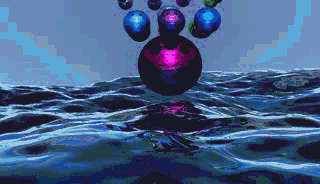

# OceanFFT & PathTracing using MapReduce
本项目是我们小组在清华大学计算机系2018年分布式系统课程的大作业。

最终项目Report见report.pdf。

frontend/的代码是用于生成海洋和小球的每一帧的数据，其中使用了mapreduce计算二维FFT，以及计算物理引擎的小球碰撞和小球所受浮力。

render/是用java实现的path tracing，包括网格平滑、软阴影、超采样等效果，并且使用mapreduce进行加速。

最终渲染出的视频结果可以见：https://youtu.be/PWxAjqwj6mE

一帧的结果：

gif版demo：
